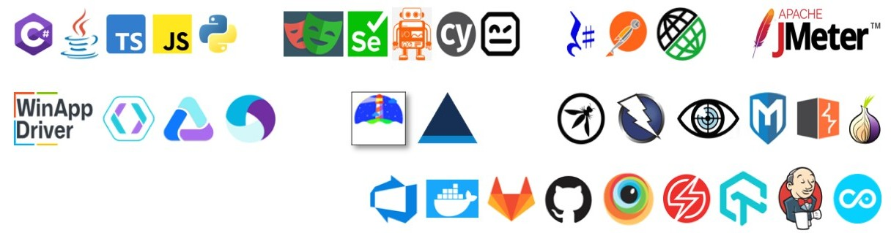

<!-- Banner -->

# 👋 Hi there, I'm Pravin Dubey
Welcome to my GitHub profile! I'm a passionate software architect with 15+ years of experience in software development, automation testing, and framework engineering. I believe in building intelligent, scalable, and ethical software solutions that empower individuals and uplift communities.

---

## ✅ Technologies & Skills

**Languages:**  
C# (15 yrs), Java (10 yrs), Python (6 yrs), JavaScript & TypeScript (4 yrs)

**Databases:**  
MSSQL, MySQL, Oracle, Snowflake, Kafka, IBM(Db2i, Db2z, Db2luw) 

**Automation Tools:**  
- **Web:** Selenium, Playwright, Robot Framework, Cypress, WebDriver.IO, Copado  
- **Desktop:** CodedUI, WinAppDriver, FlaUI, UFT, LeanFT
- **API:** HttpClient, httpClientFactory, RestSharp, RestAssured, Copado
- **Mobile:** Appium, Xamarin.UITest
- **Accessibility:** LightHouse, Axe, Deque
- **Performance:** JMeter, LoadRunner
- **Security:** OWASP, ZAP, NMap, BurpSuite, Metasploit

**Frameworks:** MSTest, NUnit, Xunit, JUnit,TestNg, Chai, Mocha, PyTest, Gherkin(Speflow, Cucumber, Reqnroll)  
**CI/CD:** Jenkins, Azure DevOps, Copado
**Code Quality:** SonarQube, Roslyn, Snyk
**Cloud:** SauceLabs, BrowserStack, LambdaTest, AppCenter, Katalon, Copado  
**Certifications:**  
  ✅ ISTQB CTFL  
  ✅ CertiProf CLA  
  ✅ PSM I  
  ✅ Microsoft Certified Technology Specialist

---

## 🌍 Open Source Contributions

I actively contribute to the open-source community by developing robust, reusable, and scalable automation and testing frameworks.

### 🔧 Frameworks & Tools

1. **Test Automation Frameworks**  
   - Web: Selenium, Playwright, Cypress  
   - Mobile: Appium, Xamarin.UITest  
   - Desktop: CodedUI, WinAppDriver
   - API: RestSharp, HttpClientFactory, RestAssured  

2. **Testing Utilities**  
   - Configuration Management
   - Secret Manager
   - Reporting
   - Email
   - OTP Automation
   - Azure Integration
   - Accessibility

3. **CI/CD Integrations**  
   - Pipelines & YAML templates for Azure DevOps and Jenkins

### 📦 GitHub Highlights

- 🔁 55+ Reusable Components (MIT License)  
- 📘 Well-Documented Repos  
- 🧪 Unit & Integration Tests  
- 🌐 Community Engagement

### 🏆 Impact

- ⭐ Starred by 500+ developers  
- 🍴 Forked in enterprise/startup environments  
- 🧑‍🏫 Used in training sessions and workshops

---

<!--## 📊 GitHub Stats

  
  
  

## 🤝 Let's Connect

    <a href="https://linkedin.com/in/pravin-kumar-dubey" target="blank">
            Pravin Kumar Dubey</img>
    </a>
         
    <a href="https://www.youtube.com/@automate_everything" target="blank">
            Automate Everything Channel</img>
    </a>

## 📫 Email 
<a href="mailto:pravin.k.dubey87@gmail.com">pravin.k.dubey87@gmail.com</a>
or
<a href="mailto:pravin.k.dubey87@outlook.com">pravin.k.dubey87@outlook.com</a>

Thanks for visiting my profile! 😊
